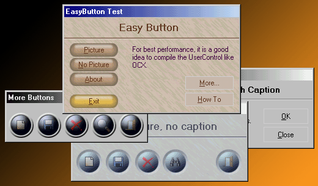



## EasyButton

### Description

If you have artistic talent, you can make buttons with this code

in any format easily. All that you have to do is draw a image.

I included some images like example.
 
### More Info
 

             |
---                |---
**Submitted On**   |2002-06-04 19:57:56
**By**             |[Arruda](https://github.com/Planet-Source-Code/PSCIndex/blob/master/ByAuthor/arruda.md)
**Level**          |Intermediate
**User Rating**    |5.0 (80 globes from 16 users)
**Compatibility**  |VB 5\.0, VB 6\.0
**Category**       |[Custom Controls/ Forms/  Menus](https://github.com/Planet-Source-Code/PSCIndex/blob/master/ByCategory/custom-controls-forms-menus__1-4.md)
**World**          |[Visual Basic](https://github.com/Planet-Source-Code/PSCIndex/blob/master/ByWorld/visual-basic.md)
**Archive File**   |[EasyButton90321642002\.zip](https://github.com/Planet-Source-Code/arruda-easybutton__1-34625/archive/master.zip)

